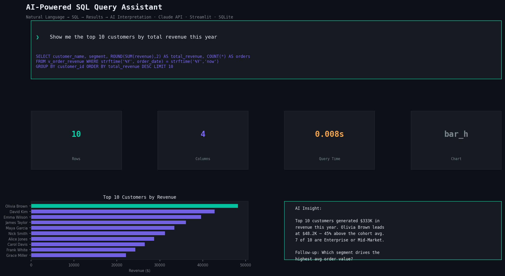

# AI-Powered SQL Query Assistant 🤖

> Ask questions in plain English — get SQL, results, charts, and AI interpretation instantly. No SQL knowledge needed.

**Built by [Darsh Jogani](https://www.linkedin.com/in/darsh-jogani-37b97218b)** | MS Business Analytics & AI, UT Dallas | FRM Candidate



---

## Overview

A natural language to SQL engine powered by Claude API. Business users type questions in plain English — the system generates accurate SQL from schema context, executes it safely, visualizes results, and provides an AI-generated business interpretation with follow-up suggestions.

Built on a realistic seeded SQLite business database (300 customers, 2,000 orders, 12 products across 6 regions) — no external database setup required.

---

## Architecture

```
User Question (plain English)
        ↓
Schema Awareness Layer  ← reads DB structure automatically
        ↓
Claude API (nl_to_sql.py) → generates accurate SQL
        ↓
Query Engine  → safe execution, read-only, 10s timeout
        ↓
Result Interpreter (Claude) → business narrative + follow-ups
        ↓
Streamlit Dashboard → chart + table + SQL + insights
```

---

## Features

- **Natural Language → SQL** via Claude API with full schema context
- **Auto chart detection** — picks line, bar, horizontal bar, or table based on result shape
- **AI Interpretation** — 3-5 sentence business narrative with key findings
- **Follow-up suggestions** — Claude recommends next questions based on results
- **Query history** — sidebar tracks previous queries, click to re-run
- **6 sample questions** shown as buttons for instant demo
- **Schema viewer** — full DB schema available in-app
- **Demo mode** — works without API key using fallback SQL
- **Read-only enforcement** — SELECT only, 500 row limit, 10s timeout

---

## Sample Questions

- "Show me the top 10 customers by total revenue"
- "What are total sales by region this year?"
- "Which products generate the most gross profit?"
- "Show monthly revenue trend for the last 12 months"
- "Which customers haven't placed an order in over 6 months?"
- "What is the gross margin percentage by product category?"

---

## Setup

```bash
git clone https://github.com/Darish999/AI-SQL-Query-Assistant.git
cd AI-SQL-Query-Assistant
pip install -r requirements.txt

# Set API key for full AI mode (optional — demo mode works without it)
export ANTHROPIC_API_KEY=your_key_here

streamlit run dashboard.py
```

The SQLite database is built automatically on first run — no MySQL or external DB needed.

---

## Project Structure

```
ai-sql-assistant/
├── database.py           # Builds & seeds SQLite business DB
├── schema_reader.py      # Extracts schema context for LLM
├── nl_to_sql.py          # Claude API — natural language → SQL
├── query_engine.py       # Safe SQL execution, result formatting, chart detection
├── result_interpreter.py # Claude API — results → business narrative
├── dashboard.py          # Full Streamlit app
├── preview.py            # Generates repo preview image
├── requirements.txt
└── README.md
```

---

## Tech Stack

| Layer | Technology |
|-------|-----------|
| AI / LLM | Anthropic Claude API (claude-sonnet) |
| Database | SQLite (built-in, no setup) |
| Data | pandas |
| Dashboard | Streamlit |
| Charts | Plotly Express |
| Preview | matplotlib |

---

## About the Author

**Darsh Jogani** — Business & Finance Analyst building end-to-end data and AI systems for finance and operations. Currently at Jindal Pipe USA as sole analytics owner (SAP ETL pipelines, 45+ Power BI dashboards, full-stack tools). Prior experience implementing treasury management software at Credence Analytics, Mumbai.

🔗 [LinkedIn](https://www.linkedin.com/in/darsh-jogani-37b97218b) · [Portfolio](https://darish999.github.io/Darshjogani.github.io/) · [GitHub](https://github.com/Darish999)
